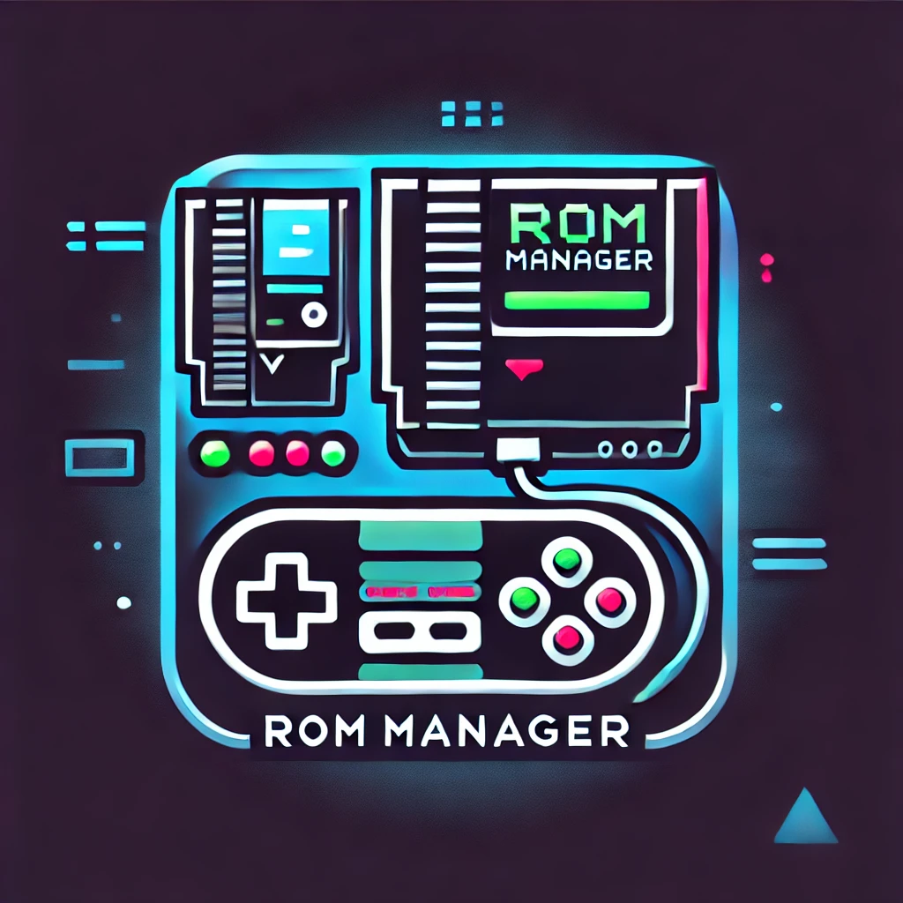

# ROMs Manager (La Raspa)

La Raspa is a terminal user interface (TUI) for RetroArch players who want to treat their ROM collection like a real library. It combines libretro’s reference databases, your preferred download providers, RetroArch frontends, and BIOS requirements in one place so you can see what exists, what you own, and what’s missing.

---

## Highlights

- **RDB-first catalog**: Every activated console uses the official libretro `.rdb` to list the entire library. Providers are layered on top so you know which ROMs your sources cover.
- **Provider-aware downloads**: Queue downloads from multiple archives, inspect torrent/http sources, and monitor jobs in a built-in download manager.
- **BIOS verification & install**: For each console/core combo, check what BIOS files are required, whether they exist in your configured RetroArch `system` folder, and (if available) press `i` to download from a trusted repo.
- **Frontend-aware activation**: Tie consoles to whichever RetroArch frontend paths you use (Steam, standalone, etc.) and track different sets of “supported” GUIDs per frontend.
- **Rich search & filtering**: Explore per-console lists or run a global search across every activated console with full metadata (region, serial, hashes, size).
- **CLI + TUI workflows**: Automate metadata downloads, schema validation, and provider management from `roms_manager.py`, then use `python3 -m tui` for the day-to-day experience.

---

## Requirements

- Python 3.11+
- Platform packages needed by `libtorrent` and `rich-pixels` (install via your OS package manager)
- Git (for pulling the libretro module list and optional BIOS repos)

Install Python dependencies:

```bash
python3 -m venv .venv
source .venv/bin/activate
pip install -r requirements.txt
```

If you hit GitHub rate limits while syncing libretro modules, set `GITHUB_TOKEN` in your shell before running the CLI.

---

## Repository Layout

```
data/
  storage/storage_config.json   <-- frontends + default paths
  providers/providers.json      <-- custom download providers
  index/libretro*.json          <-- libretro module metadata
  index/rdb/*.json              <-- exported libretro RDB payloads
  cache/<maker>/<console>/...   <-- provider exports, torrents, etc.
tui/                            <-- Textual app (screens + styles)
tools/rdb_poc.py                <-- MsgPack inspector for .rdb files
roms_manager.py                 <-- CLI utilities
```

---

## Quick Start

1. **Configure storage & frontends**
   - Edit `data/storage/storage_config.json`.
   - Add/adjust entries under `frontends` with your RetroArch ROM and BIOS paths.
   - Mark `active: true` for the frontend you want the TUI to use. Each frontend tracks its own `supported_guids` (which consoles you care about).

2. **Sync libretro modules**
   ```bash
   source .venv/bin/activate
   python3 roms_manager.py database fetch          # pulls .gitmodules snapshot with GUIDs
   ```

3. **Run the TUI**
   ```bash
   python3 -m tui
   ```

4. **Activate a console**
   - In the Database screen: highlight a module, press **SPACE** to toggle it for the active frontend.
   - Press **`a`** to fetch artwork metadata (libretro thumbnails).
   - Press **`i`** to download & export the console’s `.rdb` into `data/index/rdb/<slug>.json`.
   - Once the RDB exists, the console appears in the Console Selector and ROM Explorer.

5. **Add providers (optional but recommended)**
   - Customize `data/providers/providers.json` or use the CLI helpers:
     ```bash
     python3 roms_manager.py providers list
     python3 roms_manager.py providers add --manufacturer Sega --console "Saturn" ...
     ```
   - Each provider entry can include `files_xml`, torrents, and other metadata. When you export provider listings, ROM Explorer compares them against the RDB to show coverage per ROM.

---

## Running the TUI

Start with `python3 -m tui`. The main screens:

### Menu
Navigates to ROM Explorer, Download Manager, Settings, Database tools, and more. `Esc` always takes you one level up.

### Storage & Settings
Configure RetroArch frontends, default ROM/BIOS paths, and manage providers without leaving the TUI. Frontends can be edited via the Storage modal (press `enter` on an entry to edit paths, toggle active state, set `supported_guids`, etc.).

### Database Screen
- **[SPACE]**: toggle the highlighted console for the active frontend.
- **[a]**: rebuild the libretro artwork index for that console.
- **[i]**: download the console’s `.rdb`, auto-detect the MsgPack payload, and export it to JSON.
- **Enter/D**: open the Console Detail modal (see below).

### Console Detail Modal
Shows:
- Active frontend + ROM/BIOS paths
- Provider list for that console
- BIOS requirements per core (including MD5 hashes, statuses, and a way to download missing files with `i`)
- RDB export status/path

### ROM Explorer
- Driven by the RDB export plus provider coverage.
- Columns show region, file size, provider coverage (`matched providers / total provider caches`) and MD5.
- `/` filters in place; text search matches any token in the metadata blob.
- `space` toggles selection without losing scroll position.
- `a` queues downloads for selected ROMs (prefers provider HTTP/torrent URLs; warns if a ROM lacks provider coverage).
- `enter` opens the detail pane with metadata + artwork preview.

### Global Search
- Same features as ROM Explorer but across every activated console at once. Selection + download queueing works globally.
- Handy for spotting missing region sets or verifying coverage gaps before you fetch a new provider.

### Download Manager
- Tracks queued jobs (torrent or HTTP) and shows status updates.
- Designed to reuse a single manager instance across screens, so you can select ROMs in Explorer and immediately monitor progress here.

---

## Command-Line Utilities

`python3 roms_manager.py` exposes several helper commands, including:

| Command | Purpose |
| --- | --- |
| `database fetch` | Sync libretro modules (.gitmodules snapshot + GUIDs). |
| `database activate --module "<Name>" [--force]` | Build/rebuild artwork index for a module (same as `[a]` in TUI). |
| `providers list` | Show configured providers and cache status. |
| `providers add/remove` | Manage `providers.json` entries from the CLI. |
| `fetch --console <name>` | Download raw provider metadata files (SQLite, XML, torrents). |
| `explore --console <name>` | Inspect provider metadata (tables, sample ROMs, optional JSON export). |
| `validate` | Validate `providers.json` against its schema. |

See `python3 roms_manager.py --help` for full argument details.

---

## Tips for RetroArch Users

- **Match GUIDs to cores**: When you toggle a console in the Database screen, you’re adding its GUID to the active frontend’s `supported_guids`. That keeps the ROM Explorer focused on the consoles you actually care about per frontend.
- **Verify BIOS paths**: The Console Detail modal checks your configured `bios_path`. If you use multiple RetroArch installs, set up multiple frontends (Steam, Standalone, etc.) with their own paths/active state.
- **Normalize filenames**: The RDB contains canonical names + hashes. Use the ROM Explorer detail view to rename your files consistently before importing into RetroArch playlists.
- **Watch provider coverage**: The Providers column’s fraction shows how many cached providers include that ROM. Use it to spot gaps (e.g., region sets you still need to download).
- **Global search for duplicates**: Because every ROM entry includes MD5/SHA1, you can quickly find duplicate dumps across consoles or providers.

---

## Troubleshooting

| Issue | Fix |
| --- | --- |
| `Module GUID missing` warning | Re-run `python3 roms_manager.py database fetch` to refresh the libretro module list. |
| ROM Explorer empty after activation | Make sure you pressed **`i`** on the console in the Database screen to export its `.rdb`. |
| Providers not showing | Confirm your providers include `libretro_guid` and that you’ve exported their listings (XML/JSON). |
| BIOS download fails | Check the BIOS entry’s `url` in `data/emulators/cores.json` and ensure the destination directory is writable. |
| Cursor jumps to top after selection | (Handled) both explorer screens now preserve the current row; upgrade if you see old behavior. |

---

## Contributing

Pull requests and feature suggestions are welcome. Ideas we’d love help with:
- RetroAchievements integration
- RetroArch playlist generation
- Additional BIOS metadata for more cores
- Better download job persistence/retries

Open an issue describing the feature or bug, branch from `main`, and submit a PR with a concise description of the change and testing steps.

---

Happy cataloging! 🎮
